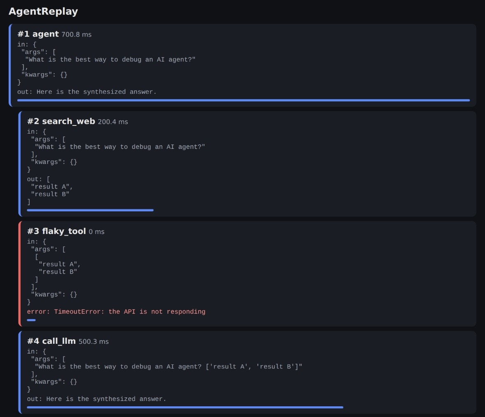

# AgentReplay

# AgentReplay

**See exactly what your AI agent did, step by step.**
Zero dependencies, one Python file, one decorator.



```python
from agentreplay import step, save, report

@step()
def call_llm(prompt): ...
```

Run your agent, then call `report("run.json", "run.html")`: you get a web page
with every call, its inputs, outputs, errors and duration.

## Install
Copy `agentreplay.py` into your project (Python 3.8+). Try `python example.py`.

## Why
Debugging an agent with `print` is painful. AgentReplay shows you the full
chain of steps and where it breaks.

## Roadmap
- [ ] Cost and token tracking per step
- [ ] Compare two runs
- [ ] OpenAI / Anthropic / LangChain integrations
- [ ] Hosted version for teams

MIT License
