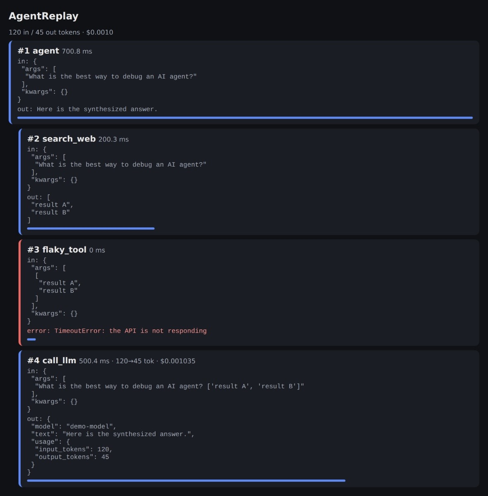

# AgentReplay

**See exactly what your AI agent did, step by step.**
Zero dependencies, one Python file, one decorator.



```python
from agentreplay import step, save, report

@step()
def call_llm(prompt): ...
```

Run your agent, then call `report("run.json", "run.html")`: you get a web page
with every call, its inputs, outputs, errors, duration, tokens and cost.

## Install
Copy `agentreplay.py` into your project (Python 3.8+). Try `python example.py`.

## Tokens and cost
If a step returns an OpenAI- or Anthropic-style response (with a `usage` field),
tokens are detected automatically. You can also call
`record(input_tokens, output_tokens, model)` inside a step.
Set your own prices to get a cost per step:

```python
from agentreplay import set_price
set_price("your-model", 3.0, 15.0)  # USD per 1M input / output tokens
```

## Why
Debugging an agent with `print` is painful. AgentReplay shows you the full
chain of steps, where it breaks, and what each step costs.

## Roadmap
- [x] Cost and token tracking per step
- [ ] Compare two runs
- [ ] OpenAI / Anthropic / LangChain integrations
- [ ] Hosted version for teams

MIT License
